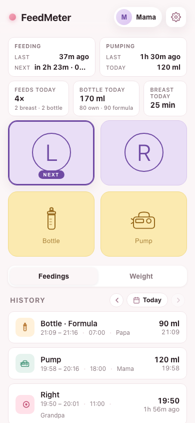
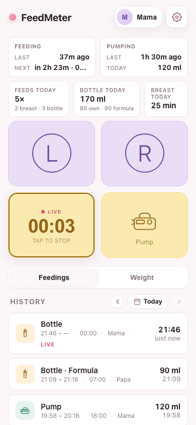
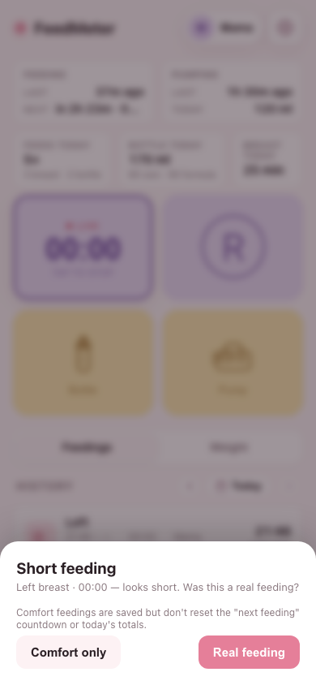
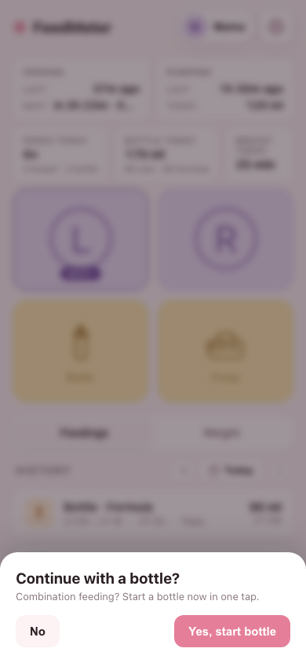
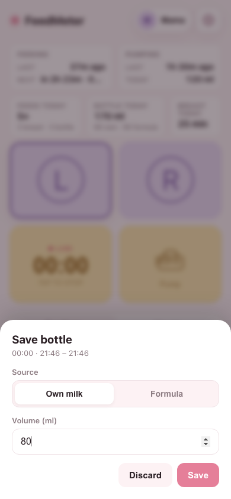
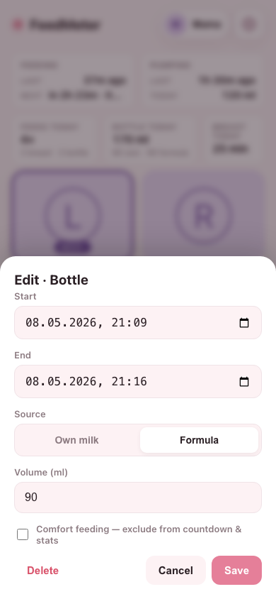
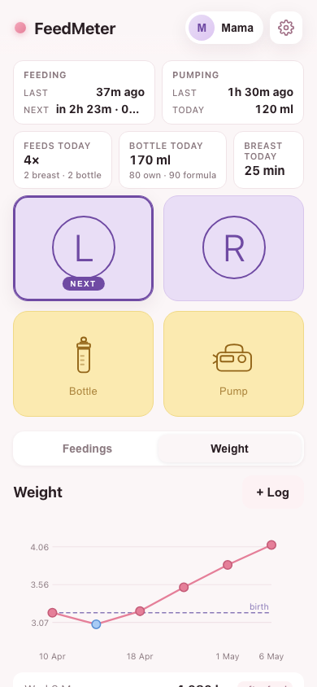
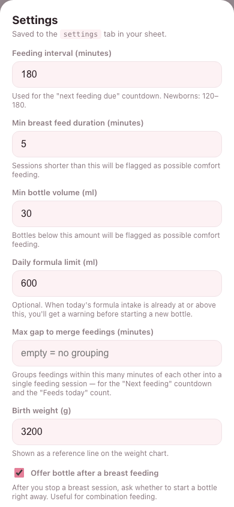
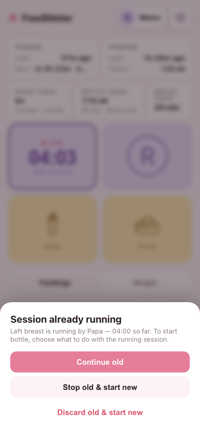

# What FeedMeter does

FeedMeter is a small web app you tap when a feeding starts and tap again when it ends. It tracks:

- **Breastfeeding** — left and right.
- **Bottle feeds** — own milk or formula, with volume.
- **Pumping** — with volume.
- **Baby weight** — over time, with a chart.

Everything lives in your own Google Sheet. If you haven't set it up yet, follow [Getting started](./getting-started.md) first.

The rest of this page is a **tour of the app** and a guide to the **everyday flows**.

---

## A tour of the home screen

From top to bottom:

- **Header.** The app name on the left. On the right: your name (tap to switch who's logging) and the **gear** icon (Settings).
- **Status row** — two compact blocks:
  - **Feeding** — when the **Last** real feed was (e.g. *"45 min ago"*) and when the **Next** is due. The *Next* line shows both the relative gap and the clock time, e.g. *"in 1h 15min · 13:30"*. Once you're past due it flips to *"overdue 12 min · 11:45"* and turns red.
  - **Pumping** — when the **Last** pump was, plus how much you've pumped **Today**.
- **Today details** — three numbers for today, each with a small breakdown line underneath:
  - **Feeds today** — how many feeds, e.g. *"5×"*, with *"2 breast · 3 bottle"* underneath.
  - **Bottle today** — total volume, e.g. *"180 ml"*, with the own-milk-vs-formula split underneath (e.g. *"60 own · 120 formula"*).
  - **Breast today** — total breastfeeding minutes, e.g. *"25 min"*.
- **Four big tiles.** **Breast L**, **Breast R**, **Bottle**, **Pump**. Tap to start, tap again to stop. Between feeds, a subtle bouncing arrow on either **L** or **R** suggests the next breast (alternating from the last one).
- **Tabs.** Switch between **Feedings** and **Weight**.
- **History list.** All entries grouped by day, with arrows to step through past days.

---

## Everyday use

### Logging a breast feeding

1. Tap **L** (or **R**). The tile flips to **LIVE** with a running timer.

   
2. When the baby is done, tap the same tile again. The session is saved instantly — no extra prompts.

If the session was very short (under your *Min breast feed duration* in Settings), you'll be asked whether it counted as a real feed or just comfort.

> **Comfort feedings** are saved but don't reset the *Next feeding* countdown and don't count toward today's totals. Useful for short suckling sessions that aren't really meals.

After the breast feed is saved, you'll be offered a one-tap shortcut to start a bottle right away — handy for combination feeding when the breast wasn't enough.

Tap **Yes, start bottle** and a bottle session begins immediately (timer running). Tap **No** (or outside the box) to skip. You can disable this prompt entirely in Settings → *Offer bottle after a breast feeding*.

### Logging a bottle

1. Tap **Bottle**. The tile goes LIVE while the baby drinks.
2. Tap again to stop. A short prompt appears:

   
3. Pick **Own milk** or **Formula**, type the **Volume (ml)**, and tap **Save**. Or tap **Discard** to throw the session away.

If you've set a **Daily formula limit** in Settings and you've already reached it for the day, you'll see a non-blocking warning *before* the bottle starts so you can decide. The warning tells you where you stand — it never stops you.

### Logging a pump

Same flow as the bottle, but the save prompt only asks for **Volume**.

### Editing or deleting an entry

Tap any entry in the history list to open the editor.

You can change:

- **Start** and **End** times.
- **Volume** and **Source** (where they apply).
- The **Comfort feeding** toggle — to include or exclude the entry from the countdown and today's totals.
- Or **Delete** the entry entirely.

### Browsing past days

Above the history list, use the **‹** and **›** arrows to step through days, or tap the date to jump to a specific one. The **Today** button brings you back.

### Tracking weight

Switch to the **Weight** tab and tap **+ Log**. Enter the weight, the date, and whether the measurement was taken **Before** or **After** a feed. The chart shows the trend over time, with a reference line at the **Birth weight** you set in Settings.

### Switching the active user

Tap your name in the top-right of the header. Pick a different person from the list, or tap **+ Add new** to create one. Each device remembers the choice — different family members on different phones automatically log under their own name.

### Settings

Tap the **gear** icon in the header.

You can change:

- **Feeding interval (minutes)** — the gap used for the *Next feeding* countdown.
- **Min breast feed duration** — sessions shorter than this trigger the comfort question.
- **Min bottle volume** — bottles smaller than this trigger the comfort question.
- **Daily formula limit** — optional warning when today's formula intake has reached the limit.
- **Birth weight** — reference line on the weight chart.
- **Offer bottle after a breast feeding** — toggle the one-tap "Continue with a bottle?" prompt that appears after each breast feed.

These values live in the `settings` tab of your Google Sheet, so every device that connects to the same sheet sees the same values.

### Multiple phones, one running session

If anyone in the family has a session running, every other device sees it as live with the timer ticking. If you try to start a new session while one is already running, you're asked what to do:

- **Continue old** — leave the running session alone.
- **Stop old & start new** — close the old session with what's logged so far, then start the new one.
- **Discard old & start new** — drop the old session entirely (nothing saved), then start the new one.

This makes hand-offs easy. Mama starts a breast feed, hands the baby over, papa's phone already shows the running timer and can switch it to a bottle in two taps.

### Working offline

If your phone is offline, the action goes through anyway and gets sent to the sheet as soon as you're back online. You can keep tapping tiles, editing entries, and logging weight; the sync catches up automatically.
